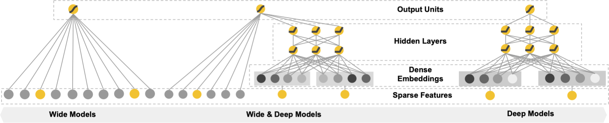
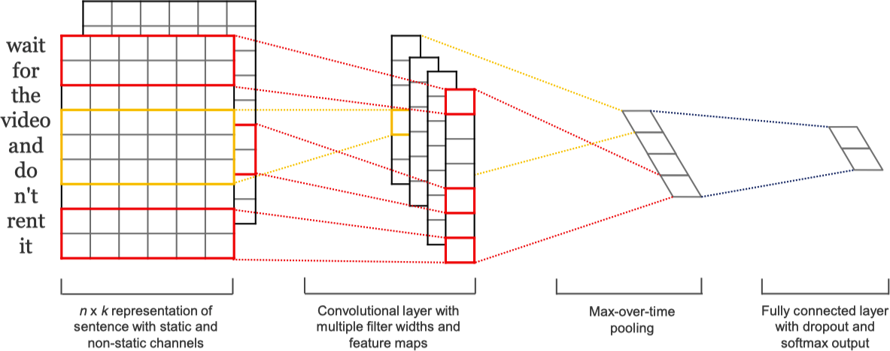
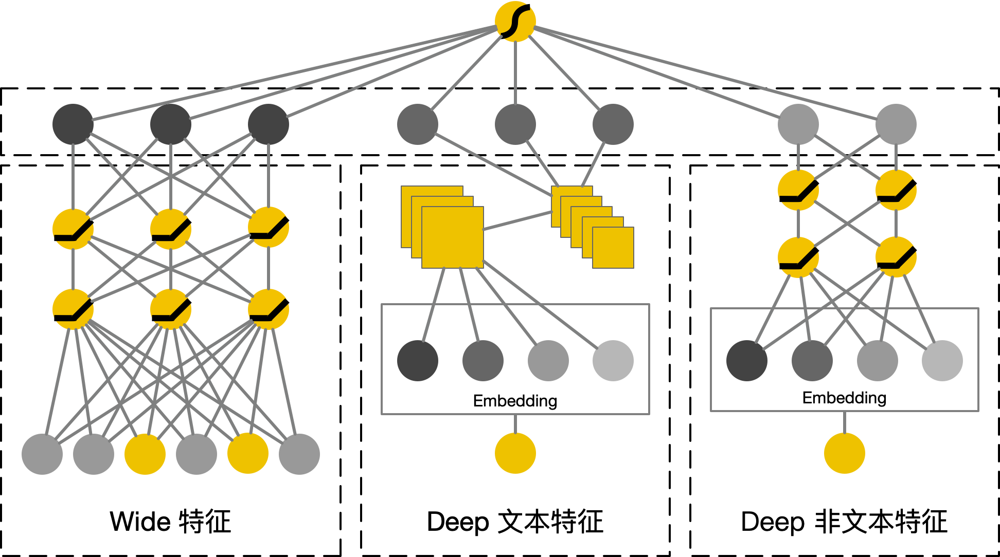
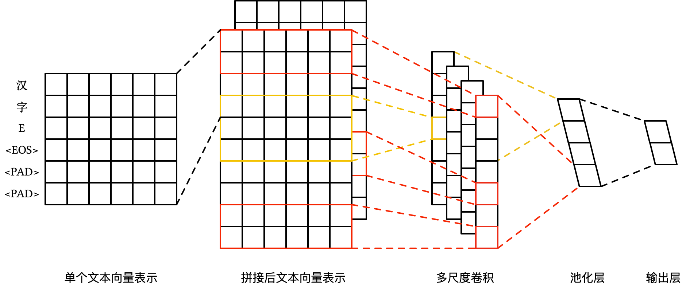
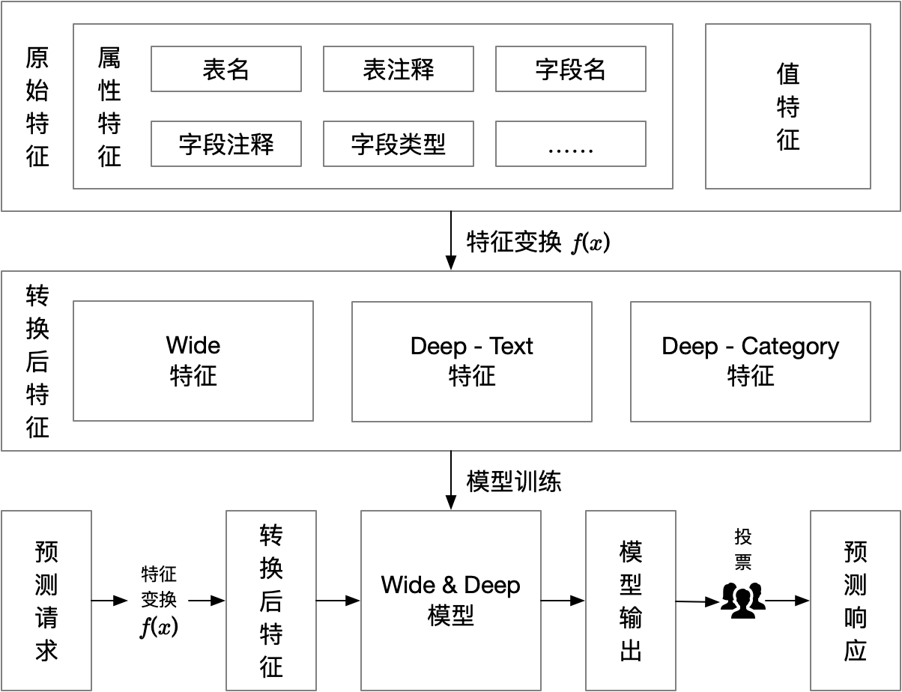

```{r setup, include=FALSE}
library(knitr)
knitr::opts_chunk$set(echo = TRUE)
knitr::opts_chunk$set(dev.args = list(bg = 'transparent'))
options(htmltools.dir.version = FALSE)

library(tidyverse)
options(knitr.table.format = 'html')
options(knitr.kable.NA = '')

library(kableExtra)
default_kable_styling <- function(kable_input) {
    kable_styling(kable_input, bootstrap_options = 'striped')
}

library(showtext)
font_add('Source Han Serif', 'SourceHanSerif.ttc')
font_add('Source Han Sans', 'SourceHanSans.ttc')
showtext_auto()

pie_default_theme <- theme_minimal() +
    theme(
        axis.title.x = element_blank(),
        axis.title.y = element_blank(),
        axis.text = element_blank(),
        axis.ticks = element_blank(),
        panel.border = element_blank(),
        panel.grid = element_blank(),
        text=element_text(family = 'Source Han Sans SC', size = 20))

density_default_theme <- theme_minimal() +
    theme(
        text=element_text(family = 'Source Han Sans SC', size = 20))
```

```{r column-meta, echo=F, message=F, warning=F}
raw_features <- read_tsv('data/raw-features.tsv',
                         col_names = T, col_types = 'ccccccccc')
column_meta <- read_tsv('../data/column_meta.tsv',
                        col_names = T, col_types = 'cccicccccccccciiic')
column_value <- read_tsv('../data/column_value.tsv',
                         col_names = T, col_types = 'ccccc')
```

# 大纲

<br/>

.grid[
.grid-cell-1of5[
<br/>
]
.grid-cell-3of5[
- ### 项目简介
- ### 数据探索性分析
- ### Wide & Deep 网络和 TextCNN
- ### 敏感字段识别模型
]
.grid-cell-1of5[
<br/>
]
]

---
class: inverse, center, middle

# 项目简介

---

# 项目简介

项目主要目的是自动化的判断数据仓库接入的数据表中各个字段的 **敏感** 情况。

目前数据平台的解决方案大致如下：

1. 申请开通数据接入平台到业务系统数据库的相关权限。
2. 申请接入人员填写接入申请表，并配置相关字段信息 (包括敏感信息)。
3. 数据仓库人员审核接入申请表，并制定存储策略。
4. 接入数据，对敏感信息进行加密，落库到数据仓库。

目前方案中，在业务人员填写接入申请表时，系统根据字段名称及其注释等相关信息，利用关键词匹配等方法对疑似敏感信息的字段进行了提示，但基于关键词匹配的方案的 **准确率** 和 **覆盖率** 都相对 **较低**。

---
class: inverse, center, middle

# 数据探索性分析

---

# 字段敏感类型

```{r column-meta-stat, echo=F, message=F, warning=F, cache=T}
stage_table_count <- nrow(distinct(column_meta, stage_table_name))
stage_column_count <- nrow(distinct(column_meta, stage_table_name, stage_column_name))
stage_sensitive_column_count <- nrow(filter(column_meta, column_is_sensitive==1))
stage_sensitive_column_with_type_count <- nrow(filter(column_meta, column_is_sensitive==1, !is.na(column_sensitive_type)))
```

目前 (截止 **2018-08-01**) 接入的表共 **`r stage_table_count`** 个，字段数量共 **`r stage_column_count`**，其中敏感字段共 **`r stage_sensitive_column_count`** 个，占比 **`r sprintf('%.2f%%', stage_sensitive_column_count/stage_column_count*100)`**，包含具体敏感类型的敏感字段共 **`r stage_sensitive_column_with_type_count`** 个，占比 **`r sprintf('%.2f%%', stage_sensitive_column_with_type_count/stage_column_count*100)`**。

在 **`r stage_sensitive_column_with_type_count`** 个有具体敏感类型的敏感字段中，敏感类型及其占比情况如下：

```{r sensitive-types, dpi=200, fig.width=8, fig.height=3.5, out.width="100%", out.height="50%", echo=F, message=F, warning=F}
column_meta %>%
    filter(!is.na(column_sensitive_type), column_is_sensitive == 1) %>%
    count(column_sensitive_type) %>%
    mutate(label_pos = sum(n) - cumsum(n) + n / 2,
           percentage = n / sum(n) * 100,
           label = ifelse(percentage > 1, sprintf('%.2f%%', percentage), '')) %>%
    ggplot(aes(x = 0.5)) +
    geom_bar(aes(y = n, fill = column_sensitive_type),
             width = 1, stat = 'identity') +
    guides(fill = guide_legend('字段敏感类型', ncol = 2)) +
    geom_text(aes(x = 0.7, y = label_pos, label = label)) +
    coord_polar('y', start=0) +
    pie_default_theme
```

---

# 原始特征

```{r raw-features, echo=F, message=F, warning=F}
raw_features %>%
    select(c(2, 3, 5, 6, 8, 9)) %>%
    kable(booktabs = T, longtable = T, escape = F,
          col.names = c('名称', '类型', '名称', '类型', '名称', '类型')) %>%
    footnote(symbol = c('仅作为训练数据关联使用'))
```

---

# 表主题 (分类特征)

```{r table-theme-percentage, dpi=200, fig.width=8, fig.height=4, out.width="100%", out.height="50%", echo=F, message=F, warning=F}
column_meta %>%
    count(table_theme) %>%
    mutate(label_pos = sum(n) - cumsum(n) + n / 2,
           percentage = n / sum(n) * 100,
           label = ifelse(percentage > 1, sprintf('%.2f%%', percentage), '')) %>%
    ggplot(aes(x = 0.5)) +
    geom_bar(aes(y = n, fill = factor(table_theme)),
             width = 1, stat = 'identity') +
    guides(fill = guide_legend('表主题', ncol = 2)) +
    geom_text(aes(x = 0.7, y = label_pos, label = label)) +
    coord_polar('y', start=0) +
    pie_default_theme
```

---

# 表主题 (分类特征)

```{r table-theme-sensitive-percentage, dpi=200, fig.width=10, fig.height=6, out.width="100%", out.height="50%", echo=F, message=F, warning=F}
column_meta %>%
    select(table_theme, column_is_sensitive) %>%
    filter(!is.na(table_theme), !is.na(column_is_sensitive)) %>%
    count(table_theme, column_is_sensitive) %>%
    mutate(
        table_theme = factor(table_theme),
        column_is_sensitive = factor(
            column_is_sensitive, labels = c('非敏感', '敏感'))) %>%
    group_by(table_theme) %>%
    mutate(
        percentage = n / sum(n) * 100,
        label = ifelse(percentage > 1, sprintf('%.2f%%', percentage), '')) %>%
    ungroup %>%
    ggplot(aes(x = 1, y = n, fill=column_is_sensitive)) +
    geom_bar(width = 1, stat = 'identity', position = position_fill()) +
    guides(fill = guide_legend('是否敏感', ncol = 2)) +
    facet_wrap(~ table_theme, ncol = 6) +
    geom_text(aes(label = label), position = position_fill(vjust = 0.5)) +
    coord_polar('y', start=0) +
    pie_default_theme +
    theme(legend.position = 'top')
```

---

# 字段内容长度 (数值特征)

```{r column-value-setup, echo=F, message=F, warning=F}
column_value_length_threshold <- 50
```

字段内容长度 (**衍生特征**) 具有比较明显的长尾现象，下图为截取长度为 **`r column_value_length_threshold`** 后 (**长尾分布**) 的字段内容的长度分布情况：

```{r column-value-length-density, dpi=200, fig.width=8, fig.height=4, out.width="100%", out.height="50%", echo=F, message=F, warning=F}
column_value %>%
    select(column_value, column_is_sensitive) %>%
    filter(!is.na(column_is_sensitive)) %>%
    mutate(column_value_length=str_length(column_value)) %>%
    filter(column_value_length < column_value_length_threshold) %>%
    ggplot() +
    geom_density(aes(column_value_length, color=factor(column_is_sensitive))) +
    guides(color = guide_legend('是否敏感', ncol = 2)) +
    xlab('字段内容长度') + ylab('概率密度') +
    density_default_theme
```

---

# 特征变换和衍生

.center[
#### 非文本型特征
]

.grid[
.grid-cell-1of5[
<br/>
]
.grid-cell-3of5[
- 分类型特征进行 One-Hot 编码 (共 **72** 个)
- 文本长度特征，截取，归一化 (共 **7** 个)
]
.grid-cell-1of5[
<br/>
]
]

.center[
#### 文本型特征
]

.grid[
.grid-cell-1of5[
<br/>
]
.grid-cell-3of5[
- 文本特征，截取，填补，拼接 (共 **230** 位字符)
]
.grid-cell-1of5[
<br/>
]
]

---
class: inverse, center, middle

# Wide & Deep 网络和 TextCNN

---

# Wide & Deep 网络

```{r wide-and-deep, out.width="100%", echo=F, message=F, warning=F}

```

模型预测的条件概率为 <sup>[1]</sup>：

$$P \left(Y = 1 | \mathbf{x}\right) = \sigma \left(\mathbf{w}^{\top}_{wide} \left[\mathbf{x}, \phi \left(\mathbf{x}\right)\right] + \mathbf{w}^{\top}_{deep} a^{\left(l_f\right)} + b\right)$$

其中，
$Y$ 为预测标签，
$\sigma \left(\cdot\right)$ 为 Sigmoid 函数，
$\phi \left(\mathbf{x}\right)$ 为原始特征的 
$\mathbf{x}$ 的特征组合，
$b$ 为偏置项，
$\mathbf{w}_{wide}$ 为 Wide 部分的权重，
$\mathbf{w}_{deep}$ 为应用在 Deep 部分最后一层 
$a^{l_f}$ 的权重。原文中 Wide 部分采用 **FTRL** 进行优化，Deep 部分采用 **AdaGrad** 进行优化。

.footnote[
[1] Cheng, H.-T., Koc, L., Harmsen, J., Shaked, T., Chandra, T., Aradhye, H., … Shah, H. (2016). Wide & Deep Learning for Recommender Systems. _ArXiv:1606.07792 [Cs, Stat]_.
]

---

# TextCNN

.center[
```{r text-cnn, out.width="70%", echo=F, message=F, warning=F}

```
]

卷积层中，一个特征
$c_i$ 由一个窗口内的词
$\mathbf{x}_{i:i+h-1}$ 生成 <sup>[1]</sup>：

$$c_i = f \left(\mathbf{w} \cdot \mathbf{x}_{i:i+h-1} + b\right)$$

其中，
$h$ 为窗口的大小，
$\mathbf{x}_i \in \mathbb{R}^k$ 为词向量表示，
$\mathbf{w} \in \mathbb{R}^{hk}$ 为卷积核参数，
$b \in \mathbb{R}$ 为偏置项，
$k$ 为词向量的维度。

.footnote[
[1] Kim, Y. (2014). Convolutional Neural Networks for Sentence Classification. In _Proceedings of the 2014 Conference on Empirical Methods in Natural Language Processing (EMNLP)_ (pp. 1746–1751).
]

---
class: inverse, center, middle

# 敏感字段识别模型

---

# Wide & Deep 网络 (Ours)

<br/>

.center[
```{r our-wide-and-deep, out.width="80%", echo=F, message=F, warning=F}

```

对 Wide 部分中 **文本特征** 采用 **TextCNN** 而非全连接网络。

]

---

# TextCNN (Ours)

<br/><br/>

.center[
```{r our-text-cnn, out.width="80%", echo=F, message=F, warning=F}

```

对每个 **文本特征** 先 **单独** 进行填补再进行拼接，采用 **字向量**。

]

---

# 模型参数

.center[
#### 简化模型，去除了 Deep 中的非文本特征。
]

.grid[
.grid-cell-1of6[
<br/>
]
.grid-cell-2of3[
- Wide 部分 Dropout 比例：**0.5**
- Deep 部分 Dropout 比例：**0.5**
- Concat 部分 Dropout 比例：**0.5**
- Embedding 维度：**128**
- 优化器：**
$\text{Adam} (lr=0.001, \beta_1=0.9, \beta_2=0.999)$**
- 训练数据 Batch Size: **128**
]
.grid-cell-1of6[
<br/>
]
]

---

# 模型参数 (Wide)

<br/><br/><br/>

| Name             | Layer Type     | Output Size |
| ---------------- | -------------- | ----------- |
| wide-layer-input | Input          | 79          |
| wide-layer-1     | Full Connected | 64          |
| wide-layer-2     | Full Connected | 128         |
| wide-layer-3     | Full Connected | 64          |

---

# 模型参数 (Deep)

| Name             | Layer Type  | Kernel / Stride | Padding | Output Size  |
| ---------------- | ----------- | --------------- | ------- | ------------ |
| deep-layer-input | Input       |                 |         | 230          |
| deep-layer-1     | Embedding   |                 |         | 230 × 128    |
| deep-layer-2     | Conv.       | 3 × 128 / 1 × 1 | VALID   | 228 × 1 × 64 |
| deep-layer-3     | Max Pooling | 2 × 1 / 2 × 1   | VALID   | 114 × 1 × 64 |
| deep-layer-4     | Reshape     |                 |         | 114 × 64 × 1 |
| deep-layer-5     | Conv.       | 3 × 64 / 1 × 1  | VALID   | 112 × 1 × 64 |
| deep-layer-6     | Max Pooling | 2 × 1 / 2 × 1   | VALID   | 56 × 1 × 64  |
| deep-layer-7     | Reshape     |                 |         | 56 × 64 × 1  |
| deep-layer-8     | Conv.       | 3 × 64 / 1 × 1  | VALID   | 54 × 1 × 64  |
| deep-layer-9     | Max Pooling | 2 × 1 / 2 × 1   | VALID   | 27 × 1 × 64  |
| deep-layer-10    | Flatten     |                 |         | 1728         |

---

# 模型参数 (Concat)

<br/><br/>

| Name               | Layer Type     | Output Size |
| ------------------ | -------------- | ----------- |
| concat-layer-input | Concat         | 2240        |
| concat-layer-1     | Full Connected | 512         |
| concat-layer-2     | Full Connected | 256         |
| concat-layer-3     | Full Connected | 128         |
| concat-layer-4     | Full Connected | 8           |
| concat-layer-5     | Softmax        | 8           |

---

# 训练数据

#### 训练数据生成

- 对于一个表的一个字段，定义为一个 **样本组**
- 对于每个样本组，随机从数据库中抽取 **不为空** 的 
$N = 100$ 条数据
- 对于每条数据同所在样本组的其他信息组成 **一个训练样本**
- 训练集测试集划分 **7:3**，训练集内部训练集验证集划分 **8:2**

#### 数据不均衡问题

- 数据层：过采样和欠采样
- 模型层：代价敏感学习

---

# 模型性能

.center[
### Test Accuracy: 92.54 %
]

| Class       | F1-Score | Precision | Recall  | Support |
| ----------- | -------- | --------- | ------- | ------- |
| 卡号        | 0.71447  | 0.63401   | 0.81832 | 2009    |
| 固定电话    | 0.93548  | 0.87879   | 1       | 174     |
| 地址        | 0.68513  | 0.75566   | 0.62664 | 533     |
| 姓名        | 0.94514  | 0.9611    | 0.9297  | 6643    |
| 手机        | 0.95691  | 0.96495   | 0.949   | 6412    |
| 身份证      | 0.94872  | 0.97714   | 0.9219  | 5147    |
| 邮箱        | 0.57882  | 0.47308   | 0.74545 | 330     |
| 非敏感      | 0.94021  | 0.94225   | 0.93818 | 21514   |

---

# 模型性能

.center[
### Confusion Matrix
]

|          | 卡号 | 固定电话 | 地址 | 姓名 | 手机 | 身份证 | 邮箱 | 非敏感 |
| -------- | :--: | :------: | :--: | :--: | :--: | :----: | :--: | :----: |
| 卡号     | 1644 | 0        | 0    | 0    | 0    | 0      | 0    | 365    |
| 固定电话 | 0    | 174      | 0    | 0    | 0    | 0      | 0    | 0      |
| 地址     | 1    | 0        | 334  | 0    | 0    | 0      | 0    | 198    |
| 姓名     | 1    | 0        | 0    | 6176 | 100  | 0      | 1    | 365    |
| 手机     | 0    | 24       | 0    | 100  | 6085 | 3      | 0    | 200    |
| 身份证   | 93   | 0        | 100  | 0    | 100  | 4745   | 0    | 109    |
| 邮箱     | 0    | 0        | 6    | 49   | 21   | 8      | 246  | 0      |
| 非敏感   | 854  | 0        | 2    | 101  | 0    | 100    | 273  | 20184  |

---

# 工作流程

.center[
```{r process, out.width="80%", echo=F, message=F, warning=F}

```
]

---
class: inverse, center, middle

# Thanks


<span>&nbsp;&nbsp;&nbsp;&nbsp;</span>


**本作品采用 [CC BY-NC-SA 4.0](https://creativecommons.org/licenses/by-nc-sa/4.0/) 进行许可**

**了解更多内容，来我 [主页]看看吧**
